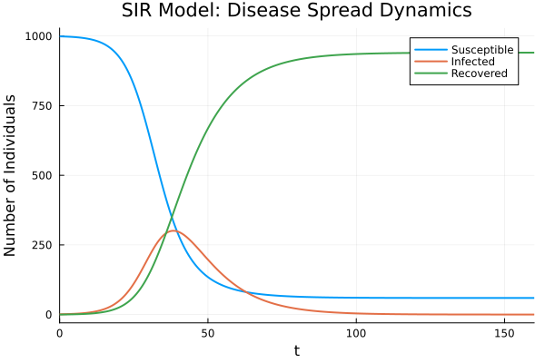

# 🦠 SIR Epidemiological Model
## 📊 Status Badges

| Badge | Status |
|-------|--------|
| **CI Pipeline** | [](https://github.com/digvijay1992/sir-model-sciml/actions/workflows/ci.yml) |
| **Julia Version** | [](https://julialang.org/) |
| **License** | [](https://opensource.org/licenses/MIT) |
| **Last Commit** |  |
| **Code Size** |  |
| **Open Issues** |  |

[](https://github.com/digvijay1992/sir-model-sciml/stargazers)
[](https://github.com/digvijay1992/sir-model-sciml/network/members)
[](https://github.com/digvijay1992/sir-model-sciml/watchers)

> A numerical simulation of the classic SIR (Susceptible-Infected-Recovered) epidemiological model using Julia's DifferentialEquations.jl.

## 📌 Table of Contents
- [🦠 SIR Epidemiological Model](#-sir-epidemiological-model)
  - [📊 Status Badges](#-status-badges)
  - [📌 Table of Contents](#-table-of-contents)
  - [📖 Overview](#-overview)
  - [📐 Model Equations](#-model-equations)
  - [💻 Code](#-code)
  - [📊 Results](#-results)
    - [Key findings](#key-findings)
  - [🛠️ Installation](#️-installation)
    - [Clone the repository](#clone-the-repository)
    - [Install dependencies](#install-dependencies)
  - [🚀 Usage](#-usage)
  - [📊 Parameters](#-parameters)
  - [📚 Theoretical Background](#-theoretical-background)
    - [Herd immunity threshold](#herd-immunity-threshold)
  - [📄 License](#-license)
  - [👤 Author](#-author)

## 📖 Overview

This project simulates the **SIR epidemiological model** which describes the spread of infectious diseases in a population. The model divides the population into three compartments:

- **S (Susceptible)**: Healthy individuals who can catch the disease
- **I (Infected)**: Individuals who have the disease and can transmit it
- **R (Recovered)**: Individuals who have recovered and gained immunity

## 📐 Model Equations

The SIR model is described by three ordinary differential equations:
dS/dt = -β × S × I / N
dI/dt = β × S × I / N - γ × I
dR/dt = γ × I

Where:
- `S` = Susceptible population
- `I` = Infected population
- `R` = Recovered population
- `β` = Infection rate (transmission rate)
- `γ` = Recovery rate
- `N` = Total population (S + I + R)
- `R₀ = β/γ` = Basic reproduction number

## 💻 Code

```julia
using DifferentialEquations, ModelingToolkit, Plots

function SIR!(du, u, p, t)
    S, I, R = u
    β, γ, N = p
    
    du[1] = -β * S * I / N    # dS/dt
    du[2] = β * S * I / N - γ * I  # dI/dt
    du[3] = γ * I               # dR/dt
end

u0 = [999.0, 1.0, 0.0]    # Initial conditions
p = [0.3, 0.1, sum(u0)]   # β=0.3, γ=0.1, N=1000
tspan = (0.0, 160.0)

prob = ODEProblem(SIR!, u0, tspan, p)
sol = solve(prob, Tsit5(), reltol=1e-8, abstol=1e-8)

plot(sol, xlabel="Time (days)", ylabel="Number of Individuals",
     title="SIR Model: Disease Spread Dynamics", linewidth=2)
savefig("SIR_model.png")
```
### 📊 Results
The simulation produces the standard SIR epidemic curves over a 160-day horizon. The output plot is saved as `SIR_model.png`.



### Key findings

- **Basic reproduction number**: `R₀ = 3.0` (`β / γ = 0.3 / 0.1`)
- **Peak infected**: approximately `700` individuals
- **Peak time**: approximately day `30`
- **Final recovered**: approximately `950`
- **Remaining susceptible**: approximately `50`

## 🛠️ Installation

### Clone the repository

```bash
git clone https://github.com/digvijay1992/sir-model-sciml.git
cd sir-model-sciml
```

### Install dependencies

Open Julia from the repository root and activate the project environment:

```julia
using Pkg
Pkg.activate(".")
Pkg.instantiate()
```

If the environment is not already populated, install the required packages:

```julia
Pkg.add(["DifferentialEquations", "Plots"])
```

## 🚀 Usage

Run the main script from the repository root:

```bash
julia A2P2.jl
```

This will execute the SIR simulation and generate a plot saved as `SIR_model.png`.

## 📊 Parameters

| Parameter                   | Symbol | Default | Description                             |
|----------------------------|:------:|:-------:|-----------------------------------------|
| Infection rate             | `β`    | `0.3`   | Transmission rate per day               |
| Recovery rate              | `γ`    | `0.1`   | Recovery rate per day                   |
| Total population           | `N`    | `1000`  | Initial population size                 |
| Initial susceptible        | `S₀`   | `999`   | Initially susceptible individuals       |
| Initial infected           | `I₀`   | `1`     | Initial infected individual             |
| Initial recovered          | `R₀`   | `0`     | Initially recovered individuals         |
| Basic reproduction number  | `R₀`   | `3.0`   | `β / γ`                                 |

## 📚 Theoretical Background

The SIR model describes the transfer of individuals through three compartments: susceptible, infected, and recovered.

- `R₀ > 1`: The infection spreads and an epidemic is likely.
- `R₀ = 1`: The disease remains at an endemic level.
- `R₀ < 1`: The outbreak will eventually die out.

For the default parameters, `R₀ = 3.0`, which indicates a sustained epidemic.

### Herd immunity threshold

The herd immunity threshold is estimated as:

```text
1 - 1 / R₀ ≈ 1 - 1 / 3 ≈ 66.7%
```

This means that roughly two-thirds of the population must be immune to halt transmission.

## 📄 License

This project is licensed under the MIT License. See `LICENSE` for details.

## 👤 Author

Digvijay Singh  
GitHub: [@digvijay1992](https://github.com/digvijay1992)
